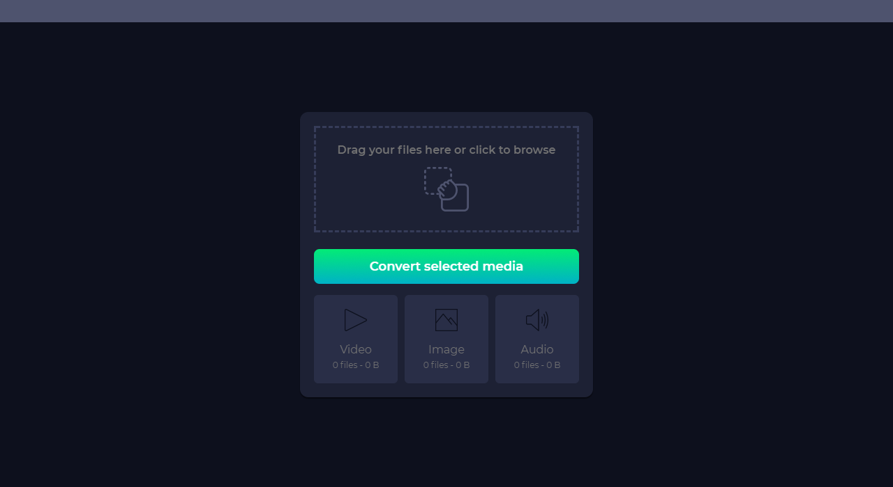

# Bulky

Fast and straightforward image optimisation.

Bulky is a tool that allows you to quickly compress your media files.

A test of 908 DSLR images with a resolution of 6000x4000 resulted in a 40x compression from 7 GB to 170 MB while taking only 2 minutes to complete.

# Features

## Images
Supported file types: JPEG, PNG, WebP, TIFF, GIF and SVG    
Planned: CR2

* Changes resolution to < 1920x1080
* Lossy compression

## Videos
Supported file types: none    
Planned: Mp4, mov

NYI

## Audio
Supported file types: none    
Planned: mp3

NYI

# Upcoming features

* Customize settings
* Improve process indication while compressing